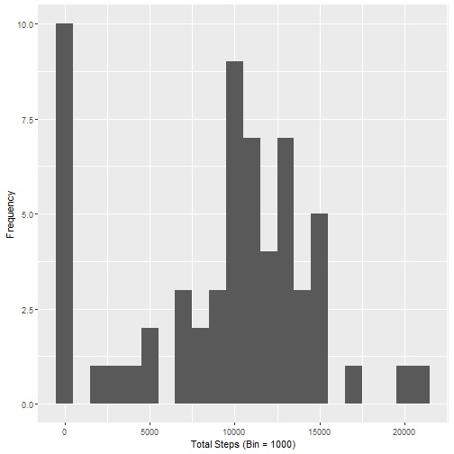
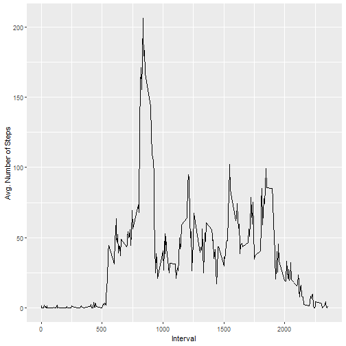
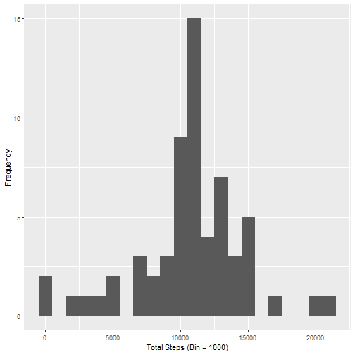
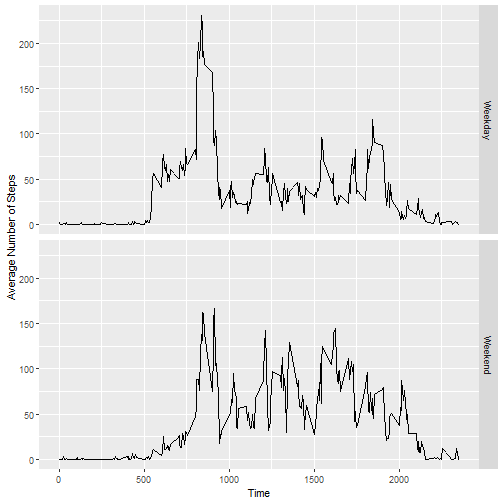

Reproducible Research Week 2 Project 1
======================================


# Loading Libraries and Data  


```r
library(dplyr)
```

```
## Warning: package 'dplyr' was built under R version 3.6.2
```

```
## 
## Attaching package: 'dplyr'
```

```
## The following objects are masked from 'package:stats':
## 
##     filter, lag
```

```
## The following objects are masked from 'package:base':
## 
##     intersect, setdiff, setequal, union
```

```r
library(ggplot2)
```

```
## Warning: package 'ggplot2' was built under R version 3.6.2
```

```r
options(scipen=999)

setwd("C://Users/cbenitez/Desktop/Coursera - Reproducible Research/Week 2 Project")
data <- read.csv("activity.csv")

# Create new column of date and interval columns to Date Time
data <- data %>%
              mutate(Date_Time = paste0(date, "_", interval))
```
  
  
  
# What is mean total number of steps taken per day?   
  
  
### 1. Calculate the total number of steps taken per day  
  

```r
# Group the data by day and sum steps

databyday <- data %>%
              select(-c(Date_Time)) %>%
              group_by(date) %>%
              summarize_all(list(sum), na.rm = TRUE)
```
  
  
  
### 2. Make a histogram of the total number of steps taken each day  
  

```r
qplot(steps, data = databyday, xlab = "Total Steps (Bin = 1000)", ylab = "Frequency", binwidth = 1000)
```


  
  
### 3. Calculate and report the mean and median of the total number of steps taken per day  
  

```r
summary(databyday$steps)
```

```
##    Min. 1st Qu.  Median    Mean 3rd Qu.    Max. 
##       0    6778   10395    9354   12811   21194
```
  
  
  
  
# What is the average daily activity pattern?   
  
### 1.Make a time series plot of the 5-minute interval (x-axis) and the average number of steps taken, averaged across all days.  
  

```r
# Remove unwanted columns and group the data by interval then average the steps
avgStepsintrvl <- data %>%
                  select(-c(date, Date_Time)) %>%
                  group_by(interval) %>%
                  summarize_all(funs(mean), na.rm = TRUE)
```

```
## Warning: funs() is soft deprecated as of dplyr 0.8.0
## Please use a list of either functions or lambdas: 
## 
##   # Simple named list: 
##   list(mean = mean, median = median)
## 
##   # Auto named with `tibble::lst()`: 
##   tibble::lst(mean, median)
## 
##   # Using lambdas
##   list(~ mean(., trim = .2), ~ median(., na.rm = TRUE))
## This warning is displayed once per session.
```

```r
# Plot data
ggplot(data = avgStepsintrvl, aes(interval, steps)) + 
          geom_line() +
          labs(x = "Interval"
              ,y = "Avg. Number of Steps")
```


  
  
### 2. Which 5-minute interval, on average across all the days in the dataset, contains the maximum number of steps? 

```r
#Filter the row with the maximum number of steps, the remove steps column to show the interval value only
intervalMaxSteps <- avgStepsintrvl %>%
                    filter(steps == max(steps)) %>%
                    select(-c(steps))
```

The interval that had the most number of steps is 835  
  
  
  
     
# Imputing missing values  
  
### 1. Calculate and report the total number of missing vlues in the dataset

```r
sum(is.na(data))
```

```
## [1] 2304
```
  
  
  
### 2. Devise a strategy for filling in all of the missing values in the dataset. The strategy does not need to be sophisticated. For example, you could use the mean/median for that day, or the mean for that 5-minute interval, etc.
  
Will be filling in missing values with the average steps by interval found in the avgStepsintrvl dataframe.  
  
  
### 3. Create a new dataset that is equal to the original dataset but with the missing data filled in.

```r
# Will be filling missing na by average steps by interval. 
# Join the original data set with avgStepsintrvl dataset
# steps.x = steps column in the "data" dataframe
# steps.y = steps column in the "avgStespintrvl" data frame
newData <- data %>%
            left_join(avgStepsintrvl, by = "interval") %>%
            mutate(newSteps = ifelse(is.na(steps.x), steps.y, steps.x)
                   ,date = as.Date(date, format = "%Y-%m-%d")) %>%
            select(-c(steps.x, steps.y))
```
  
  
  
  
### 4a. Make a histogram of the total number of steps taken each day and calculate the mean and median.  


```r
# Group the data by day and sum the number of steps from new data

newdatabyday <- newData %>%
                select(-c(Date_Time,interval)) %>%
                group_by(date) %>%
                summarize_all(list(sum), na.rm = TRUE)


#Plot data
qplot(newSteps, data = newdatabyday, xlab = "Total Steps (Bin = 1000)", ylab = "Frequency", binwidth = 1000)
```



```r
summary(newdatabyday$newSteps)
```

```
##    Min. 1st Qu.  Median    Mean 3rd Qu.    Max. 
##      41    9819   10766   10766   12811   21194
```

  
    
      
### 4b. Do the values differ from the estimates from the first part of the assignment? What is the impact of imputing missing data on the estimates of the total daily number of steps.  
Yes, the mean and median values are different from the previous calculations.  The impact for my estimates created the median and mean to have similar values.
  
  
  
# Are there differences in activity patterns between weekdays and weekends?  
  
  
### 1. Create a new factor variable in the dataset with two levels - "weekday" and "weekend" indicating whether a given date is a weekday or weekend day.  


```r
# Create new columns DayofWeek to display the actual day (Monday, Tuesday, etc...)
# Create day type to see if it is a Weekend or Weekday
dataDaytype <- newData %>% 
               mutate(DayofWeek = weekdays(date)
                      ,DayType = ifelse(DayofWeek %in% c('Saturday', 'Sunday'), "Weekend", "Weekday"))
```
  
  
  
### 2. Make a panel plot containing a time series plot of the 5-min interval and the average number of steps taken, averaged across all weekday days or weekends.

```r
# Remove unwanted columns, group by interval and Day Type then calculate the average number of steps.
avgstepIntrDay <- dataDaytype %>%
                  select(-c(DayofWeek, date, Date_Time)) %>%
                  group_by(interval, DayType) %>%
                  summarize_all(funs(mean))

#Plot Data by weekday and weekend. 
ggplot(avgstepIntrDay, aes(interval, newSteps)) + geom_line() + facet_grid(DayType~.) + labs(x="Time",y="Average Number of Steps")
```



